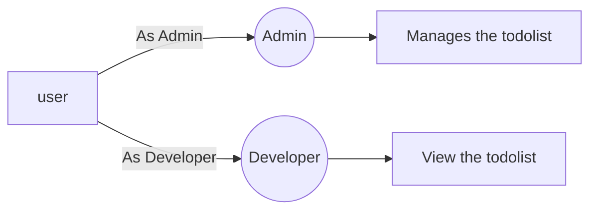

# Welcome to Work Station!

Hi! I'm Mridul. I Made this app to Get Selected in your prestigious organization.  If you want to play with Work Station, you can will get the admin credentials puls you will have two users Dev1 and Dev2 or you can create new users also. 

# Authentication

As per the requirement i had use **Devise Gem** for the authorization process and you can try to play with it.

# Authentication

For the Authentication i had used **Cancan Gem** which is controlling the user access based on their roles Admin and Client.

# App Deployment
As for the knowledege based i Had also Devployed The app in Heroku with the url (https://helooboy09.herokuapp.com/). Please have a look.

## Graphs Gem

As per Request i also added **chartkick Gem** for the graphical representation . I had not used Google Carts Api as it was overhead for the UI part. The Graphs will be Visible to the 
admin only on the index page based on the user data.

## Credentials

Admin -: admin@gmail.com
password -: password1234

Dev1 -: client1@gmail.com
password -: password12345

Dev1 -: client2@gmail.com
password -: password1234

And this will produce a flow chart:

